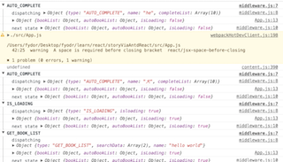
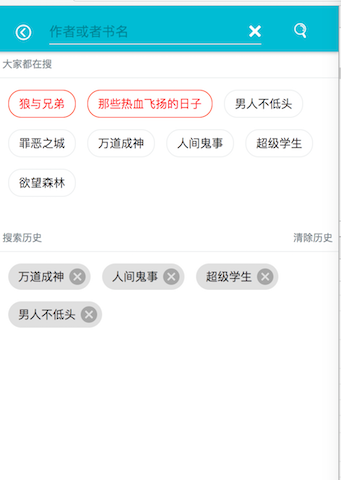
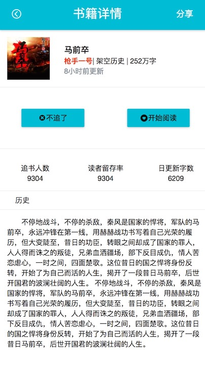
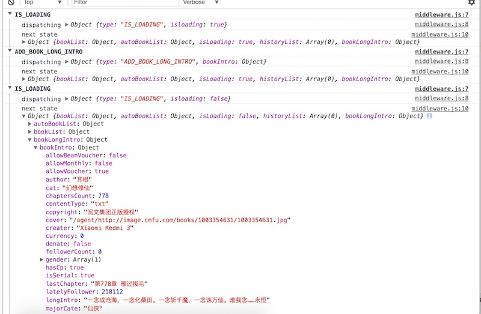
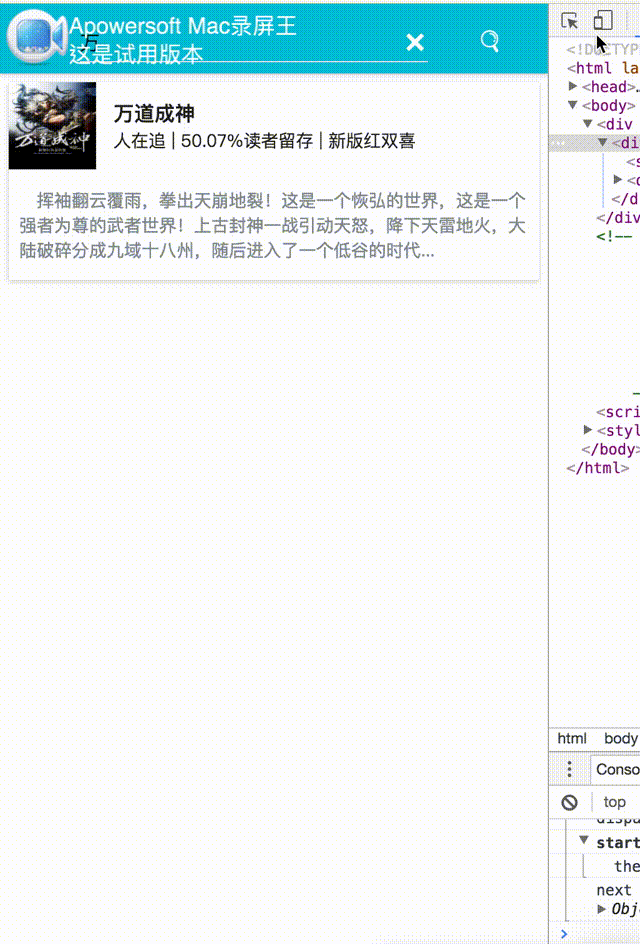
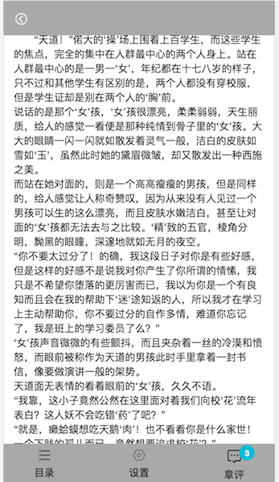

# react 动手学习好的例子 

> 看见[ShanaMaid](https://github.com/ShanaMaid/oho-reader)写了一个react读书app， 自己借用API练习一下，记录练习过程。
## 创建仓库
 通过create-react-app创建初始环境， 安装antd UI库， 按照antd官网描述修改webpack配置按需加载。详细参照[antd](https://ant.design/docs/react/use-with-create-react-app-cn)

1、在src 文件下新建components文件夹在当前文件夹下面编写组件。
2、在src 下新建source文件存放字体图片等资源


3. 新建一个router文件配置路由跳转。路由用的是react-route-dom 也就是react-router 的升级版本，路由在我的理解就是通过url来匹配组件的显示这是下面是路由配置文件
```javascript
/* src/touter/router.config.js */
import Main from '../components/Main';
import Search from '../components/Search';
import About from '../components/About';
import BookIntro from '../components/BookIntro';
import Read from '../components/Read';
import ChangeOrigin from '../components/ChangeOrigin';
const routes = [
    {
        path: '/search',
        component: Search,
        exact: true,
    },
    {
        path: '/about',
        component: About,
        exact: true,
    },
    {
        path: '/bookIntro',
        component: BookIntro,
        exact: true,
    },
    {
        path: '/read/:id',
        component: Read
    },{
        path: '/changeOrigin',
        component: ChangeOrigin,
        exact: true,
    }
    ,{
        component: Main
    }
];

export  default routes;

/*src/router/Router.js*/
/**
 * Created by fydor on 2017/5/5.
 */
import React from 'react';
import {
    BrowserRouter as Router,
    Route,
    Switch,
} from 'react-router-dom';
import routes from './router.config';
const Routers = () => (
    <Router>
        <Switch>
            {
                routes.map((route,i)=> (
                   <Route key={i} path={route.path} exact={route.exact} component={route.component}/>
                ))
            }
        </Switch>
    </Router>
);

export default Routers;
```
这样配置可以直接在配置文件中添加路由，由于只有一层路由所以对象中没有继续嵌套routes（嵌套的意思是在当前显示的组件下面还有需要通过url匹配显示的组件）路由嵌套可以参照
<font color=deepPink>[react-router-dom route-config](https://reacttraining.com/react-router/web/example/route-config)</font>

目前位置目录结构如下
```
.
├── App.js
├── App.test.js
├── components
│   ├── About.js //用来显示关于页面
│   ├── BookIntro.js //介绍
│   ├── ChangeOrigin.js //换源
│   ├── Main.js //主页显示关注的图书
│   ├── Read.js //阅读界面
│   └── Search.js //搜索页
├── index.js ／／渲染页面
├── redux
│   ├── action.js  
│   └── reducer.js
├── router
│   ├── Routers.js
│   └── router.config.js
├── source
└── styles
```

## 在create-react-app 中通过` .eslintrc `配置文件配置 eslint
通过运行<font color=deepPink >`npm run eject`</font>使其暴露webpack等配置文件
##[自定义eslint 原文连接](https://segmentfault.com/a/1190000008853805)
> 上述步骤并没有暴露react脚手架封装的eslint操作，为了使得项目统一规范化，添加jsx-eslint操作是非常不错的选择（关于js其他的eslint操作，请参见官网，本文主要针对jsx限制规范配置）。

* 在项目根目录下添加.eslintrc文件
* 在根目录找到config文件夹，并找到文件夹下的webpack.config.dev.js文件
* webpack.config.dev.js文件修改添加如下代码
```
    preLoaders: [
          {
            test: /\.(js|jsx)$/,
            loader: 'eslint',
              enforce: 'pre',
              use: [{
                  // @remove-on-eject-begin
                  // Point ESLint to our predefined config.
                  options: {
                      //configFile: path.join(__dirname, '../.eslintrc'),
                      useEslintrc: true
                  },
                  // @remove-on-eject-end
                  loader: 'eslint-loader'
              }],
            include: paths.appSrc,
          }
        ],

```
.运行npm start,此时，你编写的jsx文件都是经过.eslintrc的配置限制
<font color=deepPink> `ps: 配置的value对应的值： 0 : off 1 : warning 2 : error`</font>
不满足以下的规范设置的，编译代码时将有黄色提示
<font color=deepPink> 
<pre>
    "extends": "react-app",
           "rules": {
             "no-multi-spaces": 1,
             "react/jsx-space-before-closing": 1,        // 总是在自动关闭的标签前加一个空格，正常情况下也不需要换行
             "jsx-quotes": 1,
             "react/jsx-closing-bracket-location": 1,    // 遵循JSX语法缩进/格式
             "react/jsx-boolean-value": 1,               // 如果属性值为 true, 可以直接省略
             "react/no-string-refs": 1,      // 总是在Refs里使用回调函数
             "react/self-closing-comp": 1,    // 对于没有子元素的标签来说总是自己关闭标签
             "react/jsx-no-bind": 1,          // 当在 render() 里使用事件处理方法时，提前在构造函数里把 this 绑定上去
             "react/sort-comp": 1,            // 按照具体规范的React.createClass 的生命周期函数书写代码
             "react/jsx-pascal-case": 1        // React模块名使用帕斯卡命名，实例使用骆驼式命名
           }
         }
</pre>
</font>


## 通过material UI 去对页面布局
* 书籍详情页
* 查询列表页

## 页面写好了以后肯定就是写功能了，功能我们不一次性去写完而是用到什么添加什么
 目前书籍搜索页面布局好了以后开始添加功能,不知不觉自己的文件就变得多了。
 
 这里普及一下生成图形目录的工具 用的是tree 工具
 > 直接tree -I "node_modules|dist" 就出来了 😄 当然需要安装 这里链接一篇[mac上使用tree命令生成树状目录](http://qingtong234.github.io/2016/01/07/mac%E4%B8%8A%E4%BD%BF%E7%94%A8tree%E5%91%BD%E4%BB%A4%E7%94%9F%E6%88%90%E6%A0%91%E7%8A%B6%E7%9B%AE%E5%BD%95/)

 ```
    
├── README.md
├── config // 配置文件 create-react-app配置 缺少自己想要的功能就在上面添加
│   ├── env.js
│   ├── jest
│   ├── paths.js
│   ├── polyfills.js
│   ├── webpack.config.dev.js 
│   └── webpack.config.prod.js
├── package.json
├── scripts  // node 启动文件
│   ├── build.js
│   ├── start.js // 启动文件 配置自己的转发可以在这里配置 如devserver的proxy
│   └── test.js
├── src
│   ├── App.js
│   ├── App.test.js
│   ├── components
│   │   ├── About.js
│   │   ├── BookIntro.js
│   │   ├── ChangeOrigin.js
│   │   ├── Main.js
│   │   ├── Read.js
│   │   ├── Search.js //只是一个简单的搜索页面返回按钮
│   │   └── commont
│   │       ├── Loading.js
│   │       ├── ReturnButton.js   //只是一个简单的返回按钮
│   │       └── Share.js  //只是一个简单的分享按钮
│   ├── index.js
│   ├── redux
│   │   ├── action.js
│   │   ├── middleware   // 这里是redux middleware 写的logmiddle 和 thunk ，当然也有人家写好了的自行github
│   │   │   └── middleware.js
│   │   ├── reducer.js
│   │   └── store.js 
│   ├── router
│   │   ├── Routers.js
│   │   └── router.config.js
│   ├── source
│   ├── styles
│   │   ├── animate.css
│   │   ├── bookIntro.css
│   │   ├── font     // 配置iconfont 这里使用的阿里 👌
│   │   │   └── font.css
│   │   ├── loading.css
│   │   ├── reset.css  
│   │   ├── search.css
│   │   ├── share.css
│   │   └── variables.css
│   └── tools
│       └── index.js
└── yarn.lock

```
##编写需要用到的action
> 这里目前用到的action有获取书籍列表receiveBookList 是否显示加载框 isShowLoading
自动不全 autoComplete 以上都是同步action 
```typescript jsx
import 'whatwg-fetch';
import { urlChange } from '../tools';

export const IS_LOADING = 'IS_LOADING';
export const GET_BOOK_LIST = 'GET_BOOK_LIST';
export const AUTO_COMPLETE = 'AUTO_COMPLETE';

const receiveBookList = (data, name) => ({
    type: GET_BOOK_LIST,
    searchData: data,
    name: name
});

export const isShowLoading = (isloading) => ({
    type: IS_LOADING,
    isloading
});

export const autoComplete = (name, completeList) => ({
    type: AUTO_COMPLETE,
    name,
    completeList
});


```
 ###  异步action 这里分发异步action需要用到 middleware 作用是dispatch的时候可以传除对象外还可以是函数
 下面是middleware src/redux/middleware/middleware.js
```typescript jsx
export const thunk = (store) => next => action =>
        typeof action === 'function' ?
            action(store.dispatch, store.getState) :
            next(action);

export const logger = (store) => next => action => {
      console.group(action.type);
      console.info('dispatching', action);
      let result = next(action);
      console.log('next state', store.getState());
      console.groupEnd(action.type);
      return result;
}
```

>有了上面的middleware 就可以编写异步action了同样在 src/redux/action.js中添加
```typescript jsx
export const receiveAutoComplete = name => dispatch =>
    fetch(`book/auto-complete?query=${name}`)
        .then(res=>res.json())
        .then(data => dispatch(autoComplete(name,data.keywords)))
        .catch(error => new Error(error));


export const getBookList = (name) => dispatch => {
        dispatch(isShowLoading(true));
        return fetch(`/api/book/fuzzy-search?query=${name}&start=0`)
            .then(res => res.json())
            .then(data => data.books.map((book) => urlChange(book.cover)))
            .then(data => {
                let action = dispatch(receiveBookList(data,name));
                dispatch(isShowLoading(false));
                return action;
            })
            .catch(error => {
                new Error(error);
            })
        };

```

> action编写完毕 接下来就应该编写reducer ，reducer意思是通过action计算出下次的state由于我们会用到<font color=deepPink>conbinereducer</font>所以
可以向下面的方式编写
src/redux/reducer.js
```typescript jsx
import { IS_LOADING, GET_BOOK_LIST, AUTO_COMPLETE } from './action';

export const bookList = (state = {books:[], name: ''},action={}) => {
    switch (action.type){
        case GET_BOOK_LIST:
            let { books, name } = action;
            return {name,books}
        default:
            return state;
    }
}

export const autoBookList = (state = {lists : [],name : '' }, action) => {
   switch (action.type){
       case AUTO_COMPLETE:
            let { completeList, name} = action;
            return {lists:completeList, name};
       default: return state;
   }

}

export const isLoading = (state = false,action) => {
    switch(action.type){
        case IS_LOADING:
            return action.isloading;
        default:
            return state;
    }
}


```

>生成store底层步骤写完后下面就开始创建出我们需要的store了,创建store需要<font color=deepPink>redux 里面的方法</font>
```typescript jsx

//src/redux/store.js
import { createStore, combineReducers, applyMiddleware } from 'redux';
import * as reducer from './reducer';
import { thunk, logger} from './middleware/middleware';

let store = createStore(
    combineReducers(reducer),
    applyMiddleware(thunk,logger));

export default store;

```
>好了该有的方法我们都创建完毕在App文件中来测试一下❤先 ， 跟着我默念一遍咒语
> 神兽保佑🙏代码一次过

```typescript jsx
import React, { Component } from 'react';
import { PropTypes } from 'prop-types';
import { Provider } from 'react-redux';
import Routes from './router/Routers'
import darkBaseTheme from "material-ui/styles/baseThemes/lightBaseTheme";
import getMuiTheme from 'material-ui/styles/getMuiTheme';
import injectTapEventPlugin from 'react-tap-event-plugin';
import './styles/reset.css';
import { receiveAutoComplete, getBookList} from './redux/action';
import Loading from './components/commont/Loading';
import store from './redux/store';

store.subscribe(() =>
    console.log(store.getState())
)

store.dispatch(receiveAutoComplete('he'));

setTimeout(function () {
    store.dispatch(receiveAutoComplete('大'));
},1000)

setTimeout(function () {
    store.dispatch(getBookList('hello world'));
},2000)


/*引用tap事件适配移动端*/
injectTapEventPlugin();

class App extends Component {

  /*material-ui 需要配置主题才可以使用*/
  getChildContext() {
      return { muiTheme: getMuiTheme(darkBaseTheme) };
  }

  render() {
    return (
        <Provider store={store}>
          <div className="App">
                <Loading/>
                <Routes />
          </div>
        </Provider>
    );
  }
}

App.childContextTypes = {
    muiTheme: PropTypes.object.isRequired,
};

export default App;

```

###  <font color=deepPink> 代码跑起来 npm start</font>
看到我们的控制台发现有个小警告说闭合标签前面需要有一个空格 果断跑去加一个 ;

在看一次我们的请求都发出去了，reducer也接收到action后为我们处理了。
;


## 继续编写搜索页面并优化
*  点击搜索发送一个搜索action reducer处理后search组件获取到书籍数据显示到列表
* 优化书籍自动补全时候输入框每输入一个字符都要发送action 增加一个延时发送效果<font color=deepPink>主要方法：当输入停止后350毫秒搜索，每当输入时都清除定时器然后在添加一个定时器</font>
```typescript jsx
    constructor(props){
            super(props);
            this.state = {
                searchText:''
            }
            this.inputTimer = 0;
        }
    handleSearchAutoComplete = () => {
        const { dispatch } = this.props;
        dispatch(getBookList(this.state.searchText));
    }

    /*输入框延处理*/
    handleAutoSearchDelay = (time) => {
        const { dispatch } = this.props;
        this.inputTimer = setTimeout( () => {
            dispatch(receiveAutoComplete(this.state.searchText));
        },time);
    }
```
* 为了不让每次刷新时候都render 页面这里用了<font color=deepPink> decorator 相当于java的注解 AOP</font> ES7 的提议方法大家可以自行google一下
```typescript jsx
//只需要在类上面添加 @PureRender 就可以自动注入方法
@PureRender
class AutoCompleteClass extends Component {}
```

##下面是一个实现的方法，也可以解释为 <font color=deepPink>[高阶函数Higher Order Components ](https://medium.com/@franleplant/react-higher-order-components-in-depth-cf9032ee6c3e)</font>
```typescript jsx

//src/tools/decorators.js
function shalloEqual(next,prev) {
    if(prev === next) return true;
    const prevKes = Object.keys(prev);
    const nextKes = Object.keys(next);
    if(prevKes.length !== nextKes.length) return false;
    return prevKes.every((key)=>prev.hasOwnProperty(key) && prev[key] === next[key]);
}


function PureRender(Component) {
    if(!Component.prototype.shouldComponentUpdate){
        Component.prototype.shouldComponentUpdate = function (nextProps, nextState) {
            console.group('start equal component props and state');
            let isRender = PureRender.prototype.shouldComponentUpdate(nextProps,nextState,this.props,this.state);
            console.info('the equal result is  :' + isRender);
            console.groupEnd();
            return isRender
        }
    }
}


PureRender.prototype.shouldComponentUpdate = function(nextProps,nextState,prevProp,prevState){
    return !shalloEqual(nextProps,prevProp) || !shalloEqual(nextState,prevState);
}


export default PureRender;

```

## 搜索页面，添加历史搜索页和推荐列表需要做如下操作：
* 历史搜索页面布局
* 新增历史搜索的action 和 reducer


如果state中没有搜索列表就显示推荐列表和历史记录，历史记录还没添加本地缓存功能。
添加历史记录功能后search组件中布局内容多了起来，因此把历史和列表显示拆分成两个不通的组件，这也符合渐进式推进自己的项目。


-------------------------
##接下来添加点击搜索列表跳转书籍详情页
* 准备用Link 标签跳转到详情页，点击的同时发送一个请求书籍详情的action 然后显示在详情页。布局如下并添加action与reducer函数


```typescript jsx
// src/redux/action.js 新增
export const ADD_BOOK_LONG_INTRO = 'ADD_BOOK_LONG_INTRO';

export const addBookLongIntro = (bookIntro = {}) => ({
    type: ADD_BOOK_LONG_INTRO,
    bookIntro
})

export const receiveBookLongIntro = (bookId) => dispatch => {
    dispatch(isShowLoading(true));
    fetch(`/book/${bookId}`).then(res => res.json())
        .then(data => {
            dispatch(addBookLongIntro(data));
            dispatch(isShowLoading(false));
        })
        .catch(err => {
            console.error(Error(err));
        })
}

```

* 在reducer中添加处理函数
```typescript jsx
//src/redux/reducer.js

export const bookLongIntro = (state = {}, action) =>{
    switch (action.type){
        case ADD_BOOK_LONG_INTRO:
            let {bookIntro } = action;
            return { bookIntro }
        default:
            return state;
    }
}

//App.js 测试一下
store.dispatch(receiveBookLongIntro('57206c3539a913ad65d35c7b'));
//然后看打印日志
```
###  测试详细介绍

* 接下来要做的就是往自己写的详情页面塞数据，相信大家都能做到。

### bug 遇到一个点击穿透的问题，当点击自动补全的列表时，实际上会点到下面介绍列表。


* 猜测是因为选择补全列表后移动设备有300ms延迟，在300ms内补全列表隐藏了所以就点击到查询列表项。
试了好几种解决办法 发现不是什么300ms的问题。因为通过router 的 history.push() 方法延迟跳转后还是会跳转，感觉就是直接点击到上面的。

* 不解决自己没法往下做了,耗时快两天(心里惦记着她) 。无奈之下在input输入框onfous的时候用一个加载层遮住下面的list使其不能点击😭
*  如有其他良策或者什么原因请一定告诉我，感激不尽。


##给历史记录添加缓存
> 通过storejs （给localStorage 添加几个操作方法，少了一次字符串和json转换）添加缓存，并在App.js中启动时候调用一次读取上次的缓存。

## 修改了一下文件的存放 
> 文件安装模块简历文件夹存放文件


## 添加章节列表 

* 添加action
* 添加reducer
* 编写组件


```typescript jsx

//action
// 章节列表，需要先获取书源信息
export const getChpters = id => dispatch => {
    dispatch(isShowLoading(true));
    let chapters = {};
    fetch(`/api/toc?view=summary&book=${id}`)
        .then(res => res.json())
        .then(data => {
           let sourceId =data[0]._id;
           for(let item of data){
               // 为什么要用他的 我也不知道 可能是比较好拿
               if(item.source === 'shuhaha'){
                   sourceId = item._id;
               }
           }
            chapters.sourceId = sourceId;
            return fetch(`/api/toc/${sourceId}?view=chapters`)
        })
        .then(res => res.json())
        .then(data => {
            chapters.chapters = data;
            let action = dispatch(addChapters(chapters));
            dispatch(isShowLoading(false));
            return action;
        })
        .catch(error => {
            dispatch(isShowLoading(false));
            new Error(error);
        })

}
```

```typescript jsx
//redcer

//书籍章节列表
export const chaptersList = (state = {}, action) => {
    switch (action.type){
        case ADD_CHAPTERS_LIST:
            return action.chapters;
        default:
            return state;
    }
}

```

编写功能模块之前前都应该先写好action和reducer 这样可以写组件的时候确定好方向。


## 阅读页面 
* 老规矩先编写action，reducer

```typescript jsx

/*详细阅读*/
export const getReadDetail = url => dispatch => {
    if(url === '') return ;
    dispatch(isShowLoading(true));
    return fetch(`/chapter/${url}?k=2124b73d7e2e1945&t=1468223717`)
        .then(res => res.json())
        .then(data => {
            let action = dispatch(readDetail(data));
            dispatch(isShowLoading(false));
            return action;
        })
        .catch(err=> {
            dispatch(isShowLoading(false));
            new Error(err)
        });

}

```
> 通过connect 传入的dispatch 方法触发一个getReadDetailaction <font color=deepPink>dispatch(getReadDetailaction(url)) </font> redux会直接调用reducer函数改变state

```typescript jsx
//详细阅读
export const readDetail = (state = {}, action) => {
    switch (action.type){
        case ADD_READ_DETAIL:
            action.readObj && storejs.set('readDetail', action.readObj);
            return action.readObj.chapter;
        default:
            return state;
    }
}
```
> 触发action后reduer函数改变state我们的state就会增加一个和reduer处理函数名字一样的属性<font color=deepPink>readDetail </font>（这主要是combineReducers帮我们简化了一小部分，不懂需要去看看redux文档）state下图：


* 这图中的`readDetail` 是action 请求到数据给reducer处理后的state

### 然后包装我们的组件

```typescript jsx
class ReadDetail extends Component {
    // ...
}

const mapStateToProps = (state) => ({
    readDetail:state.readDetail,
})

const mapDispatchToProps = (dispatch) => ({
    getReadDetail:(id)=> dispatch(getReadDetail(id))
})

export default connect(mapStateToProps,mapDispatchToProps)(ReadDetail);
```

* 在需要的页面直接调用即可 当state改变时候组件就会自动更新

目前界面为下面的效果需要有修改背景颜色，改变字体大小等功能可以考虑一下怎么实现。




